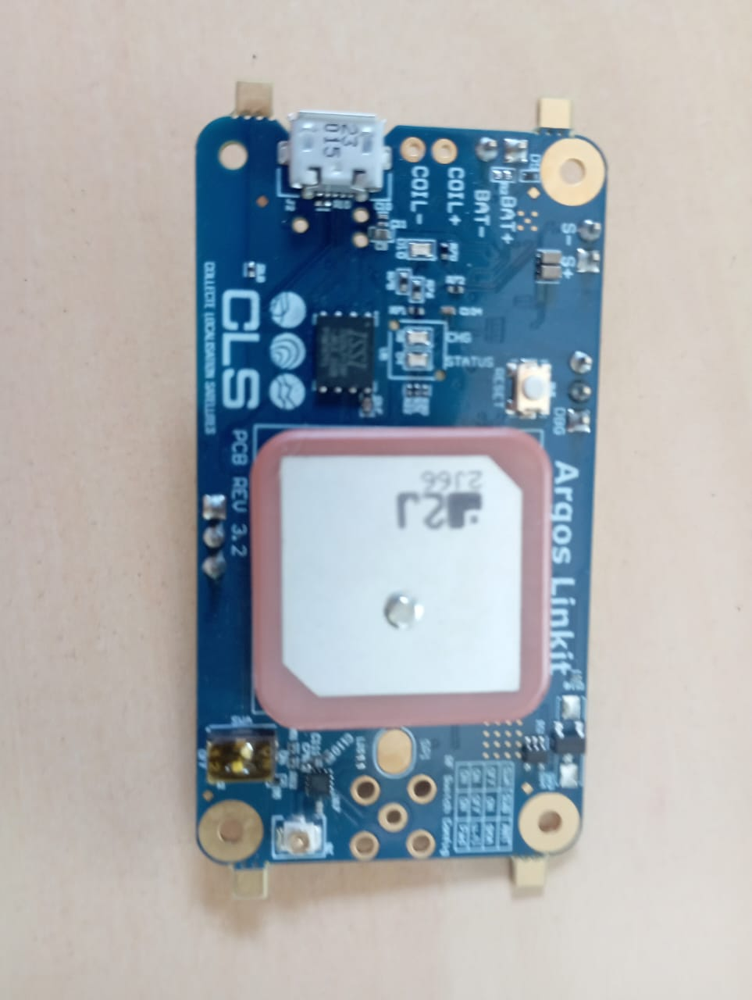

.. _linkit_core_nrf52840:

Linkit CORE nRF52840
#################################

Overview
********

The Arribada/CLS Linkit board is based on nRF52840 ARM Cortex-M4F CPU:
The boards include following feature elements :

* :abbr:`ADC (Analog to Digital Converter)`
* CLOCK
* FLASH
* :abbr:`GPIO (General Purpose Input Output)`
* :abbr:`I2C (Inter-Integrated Circuit)`
* :abbr:`MPU (Memory Protection Unit)`
* :abbr:`NVIC (Nested Vectored Interrupt Controller)`
* :abbr:`PWM (Pulse Width Modulation)`
* RADIO (Bluetooth Low Energy and 802.15.4)
* :abbr:`RTC (nRF RTC System Clock)`
* Segger RTT (RTT Console)
* :abbr:`SPI (Serial Peripheral Interface)`
* :abbr:`UART (Universal asynchronous receiver-transmitter)`
* :abbr:`USB (Universal Serial Bus)`
* :abbr:`WDT (Watchdog Timer)`

Hardware
********

- nRF52840 ARM Cortex-M4F processor at 64 MHz
- 1 MB flash memory and 256 KB of SRAM
- Additional 16 MB external QSPI flash memory (IS25LP128F)
- Battery connector and charger for 3.7 V lithium polymer batteries
- Solar panel charger with SPV1050
- Wireless charger with STWLC68J
- Charging/Charged indicator LED
- Status RGB LED
- Reed switch
- SWD connector
- GNSS with uBlox M8Q chipset
- Argos communication with ARTIC-R2
- Accelerometer

Supported Features
==================

The Linkit Core nRF52840 board configuration supports the
following hardware features:

+-----------+------------+----------------------+
| Interface | Controller | Driver/Component     |
+===========+============+======================+
| ADC       | on-chip    | adc                  |
+-----------+------------+----------------------+
| CLOCK     | on-chip    | clock_control        |
+-----------+------------+----------------------+
| FLASH     | on-chip    | flash                |
+-----------+------------+----------------------+
| GPIO      | on-chip    | gpio                 |
+-----------+------------+----------------------+
| I2C(2)    | on-chip    | i2c                  |
+-----------+------------+----------------------+
| MPU       | on-chip    | arch/arm             |
+-----------+------------+----------------------+
| NVIC      | on-chip    | arch/arm             |
+-----------+------------+----------------------+
| PWM       | on-chip    | pwm                  |
+-----------+------------+----------------------+
| RADIO     | on-chip    | Bluetooth,           |
|           |            | ieee802154           |
+-----------+------------+----------------------+
| RTC       | on-chip    | system clock         |
+-----------+------------+----------------------+
| SPI       | on-chip    | spi                  |
+-----------+------------+----------------------+
| UART(2)   | on-chip    | serial               |
+-----------+------------+----------------------+
| USB       | on-chip    | usb                  |
+-----------+------------+----------------------+
| WDT       | on-chip    | watchdog             |
+-----------+------------+----------------------+
| QSPI      | on-chip    | qspi                 |
+-----------+------------+----------------------+

Connections and IOs
===================

LED
---

* LED0 (green) = P1.10
* LED1 (red) = P1.7
* LED2 (blue) = P1.4

Reed Switch
-----------

* REED_SW = P1.3

UART
----

* UART0_TX = P1.9
* UART0_RX = P1.8
* UART1_TX = P0.11
* UART1_RX = P0.14

I2C
---

* I2C0_SDA = P1.14
* I2C0_SCL = P1.13
* I2C1_SDA = P0.27
* I2C1_SCL = P0.15

SPI
---

* SPI2_SCK = P0.8
* SPI2_MOSI = P0.6
* SPI2_MISO = P0.7

QSPI
----

* QSPI_SCK = P0.19
* QSPI_IO0 = P0.21
* QSPI_IO1 = P0.23
* QSPI_IO2 = P0.22
* QSPI_IO3 = P1.0
* QSPI_CS = P0.24

Programming and Debugging
*************************

Applications for the ``linkit_core_nrf52840`` board configuration
can be built and flashed in the usual way (see :ref:`build_an_application`
and :ref:`application_run` for more details).

Flashing
========

Flashing Zephyr onto the ``linkit_core_nrf52840`` board requires
an external programmer. The programmer is attached to the SWD header.

Build the Zephyr kernel and the :zephyr:code-sample:`blinky` sample application:

   .. zephyr-app-commands::
      :zephyr-app: samples/basic/blinky
      :board: linkit_core_nrf52840
      :goals: build
      :compact:

Flash the image:

   .. zephyr-app-commands::
      :zephyr-app: samples/basic/blinky
      :board: linkit_core_nrf52840
      :goals: flash
      :compact:

You should see the green LED blink.

References
**********

.. target-notes::

.. _Linkit Core nRF52840 Wiki:
    https://github.com/arribada/CLS-Argos-Linkit-CORE/wiki

